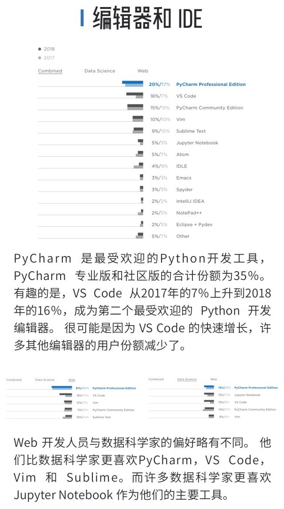
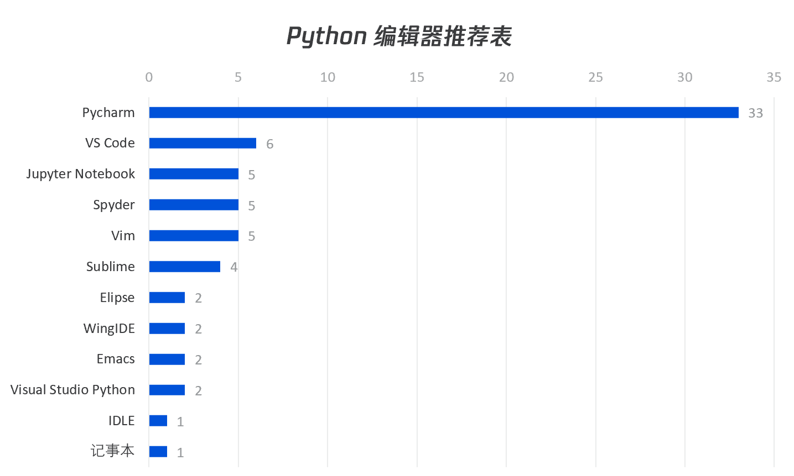

# Python的IDE

Python开发，有很多编辑器和IDE可以用。

关于Python的IDE选择，总的意见是：

* 新手：系统自带**文本编辑器**
  * 原因：先搞懂基本的Python开发逻辑和流程，再换用更好更高级的IDE，利于循序渐进的学习
* 老手：优先推荐 [VSCode](https://book.crifan.com/books/best_editor_vscode/website/debug_code/debug_python.html)，其次推荐 [PyCharm](http://book.crifan.com/books/most_intelligent_python_ide_pycharm/website)
  * 原因：充分利用`VSCode`和`PyCharm`的功能，打造顺手的工具，提高开发效率

附带：

* 做数据分析的：建议用`Spyder`
  * 且可以考虑安装`anaconda`，其中自带了`Spyder`
* 以前也试过其他的：`PyScripter`
  * [【记录】使用Python的IDE：PyScripter – 在路上](https://www.crifan.com/try_with_python_ide_pyscripter/)
* 相关：
  * [编辑器和IDE总结](https://book.crifan.com/books/editor_ide_summary/website/)
    * [【整理】各种Python的IDE(集成开发环境)的总结和对比 – 在路上](https://www.crifan.com/summary_common_python_ide_pyscripter_ulipad_eclipse_pydev_eric/)
      * [4.1.3.2. 目前常见的一些Python的IDE - - python初级教程：入门详解](https://www.crifan.com/files/doc/docbook/python_beginner_tutorial/release/webhelp/common_python_ide.html)
* 相关Python的IDE统计，供参考：
  * 
  * 
