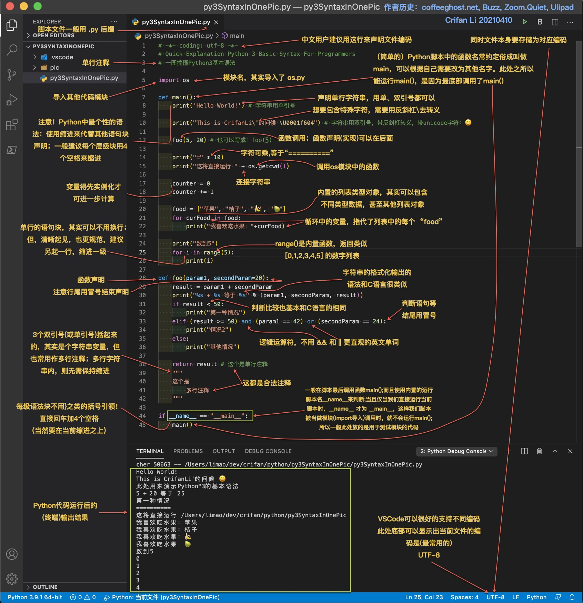

# 编程语言通用语法

* 快速了解Python的基本语法
  * 一图搞懂Python基本语法
    * 
      * 源码：[py3SyntaxInOnePic.py](https://book.crifan.com/books/make_life_better_python/website/assets/file/py3SyntaxInOnePic.py)
      * 原始(Snagit)文件：[一图搞懂Python基本语法_20210410.snagproj](https://book.crifan.com/books/make_life_better_python/website/assets/file/一图搞懂Python基本语法_20210410.snagproj)
