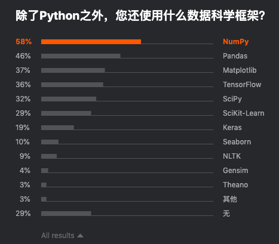
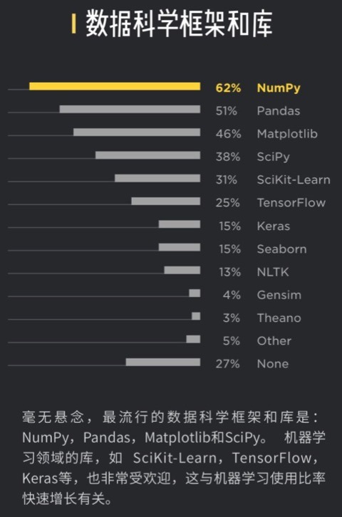
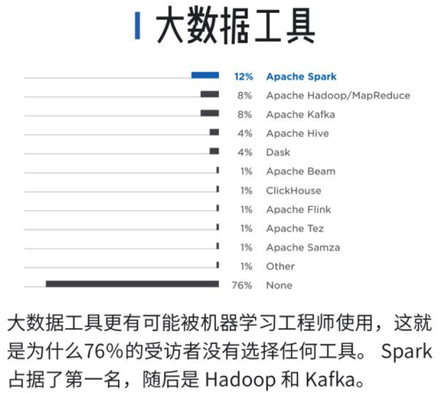

# 数据科学和人工智能

## 数据科学框架和库

* 用的比较多的
  * Numpy
  * Pandas
  * Matplotlib
  * Scipy
  * SciKit-Learn
  * TensorFlow
  * Keras
  * Seaborn
  * NLTK
* 详见
  * 
  * 

## 大数据相关的库和框架

* 用的比较多的Python的大数据相关库有
  * Apache Spark
  * Apache Hadoop/MapReduce
  * Apache Kafaka
  * Apache Hive
* 详见
  * 
