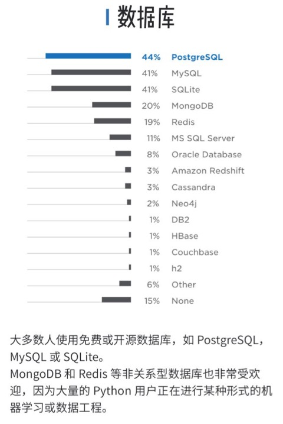
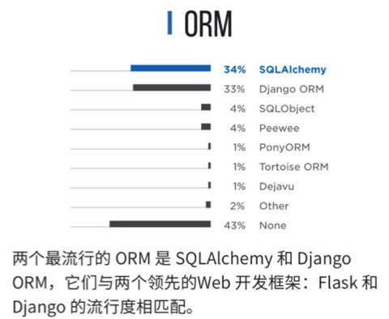

# 数据库

* 常用的Python操作的数据库有
  * PostgrelSQL
  * MySQL
  * SQLite
  * MongoDB
    * 相关教程
      * [主流文档型数据库：MongoDB](https://book.crifan.com/books/popular_document_db_mongodb/website/)
  * Redis
  * MS SQL Server
  * Oracle Database
* 详见
  * 

期间，操作不同数据库，有些可能会涉及到：`ORM`:

* 常见的`ORM`有：
  * SQLAlchemy
  * Django ORM
* 详见
  * 
