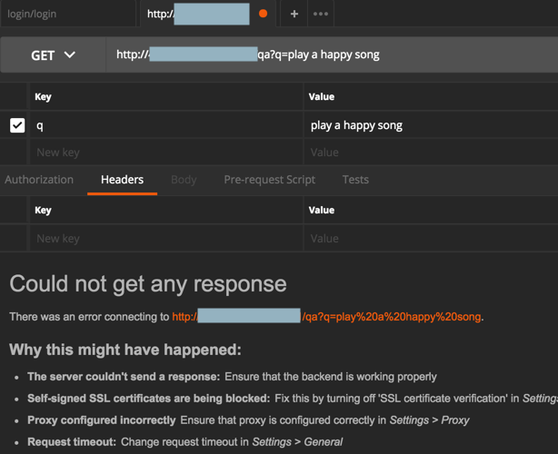
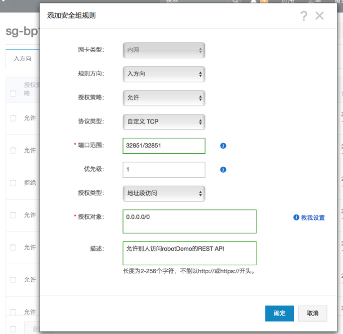
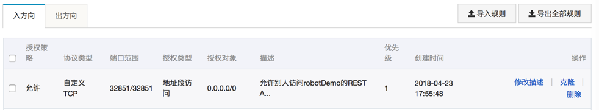

# 项目部署

此处项目部署相关内容有：

* 上传代码 = 同步代码
  * `Fabric`
    * http://www.fabfile.org/
* 部署Python项目环境
  * `gunicorn`
  * `supervisor`
    * 相关
      * 后台任务
        * `Celery`

## gunicorn

### 常见问题

#### `org.apache.http.conn.HttpHostConnectException Connect to failed Operation timed out`

**现象**：Flask的app，本地用gunicorn去运行是正常的，但是部署到线上后，用客户端去访问api出错：

```bash
org.apache.http.conn.HttpHostConnectException: Connect to x.x.x.x:port [/x.x.x.x] failed: Operation timed out (Connection timed out)
```

对应的Postman也无法访问线上端口：



**可能原因 + 解决办法 + 操作步骤**：

1. 线上环境是 阿里云的服务器。阿里云有个安全组，默认把非常用端口关闭了，导致此处无法访问对应端口。
  * **解决办法**：去阿里云的安全组中开通允许外部访问此端口
    * 
    * 
2. `gunicorn`默认不允许非本机访问端口
  * **解决办法**：修改`gunicorn`配置的端口监听，允许外部访问端口
    1. 把`Flask`中`app`的`host`改为`0.0.0.0`
      * 文件：`app.py`
        ```python
        if __name__ == "__main__":
            app.run(
                host="0.0.0.0",
                port=SERVER_PORT,
                debug=DEBUG
            )
        ```
    2. 把`gunicorn`中的`host`改为`0.0.0.0`
      * 文件：`gunicorn_config.py`
        ```python
        #bind = '127.0.0.1:32851' # 绑定ip和端口号
        bind = '0.0.0.0:32851' # 绑定ip和端口号
        ```

## supervisor

## 部署`celery+redis`的Python项目

此处把本地`Mac`中正常工作的`celery+redis`部署到在线`CentOS`中的步骤是：

### CentOS中安装redis

```bash
yum -y install redis
```

### 更新`supervisord`的配置

文件：`/etc/supervisord.d/supervisord_server.conf`

```bash
[program:redis]
directory=/xx/robotDemo
command=/usr/bin/redis-server
autostart=true
autorestart=true
stdout_logfile=/xx/robotDemo/logs/redis-%(program_name)s-stdout.log
stdout_logfile_maxbytes=2MB
stdout_logfile_backups=10
stderr_logfile=/xx/robotDemo/logs/redis-%(program_name)s-stderr.log
stderr_logfile_maxbytes=2MB
stderr_logfile_backups=10

[program:robotDemo_CeleryWorker]
command=/root/.local/share/virtualenvs/robotDemo-dwdcgdaG/bin/celery worker -A app.celeryApp
directory=/xx/robotDemo
autostart=true
autorestart=true
stdout_logfile=/xx/robotDemo/logs/celery-worker-%(program_name)s-stdout.log
stdout_logfile_maxbytes=2MB
stdout_logfile_backups=10
stderr_logfile=/xx/robotDemo/logs/celery-worker-%(program_name)s-stderr.log
stderr_logfile_maxbytes=2MB
stderr_logfile_backups=10

[program:robotDemo]
command=/root/.local/share/virtualenvs/robotDemo-dwdcgdaG/bin/gunicorn -c gunicorn_config.py app:app
directory=/xx/robotDemo
startsecs=0
stopwaitsecs=0
autostart=true
autorestart=true
killasgroup=true
stopasgroup=true
stdout_logfile=/xx/robotDemo/logs/supervisord-%(program_name)s-stdout.log
stdout_logfile_maxbytes=2MB
stdout_logfile_backups=10
stderr_logfile=/xx/robotDemo/logs/supervisord-%(program_name)s-stderr.log
stderr_logfile_maxbytes=2MB
stderr_logfile_backups=10
```

说明：

* 本地此处之前已经配置好了`supervisord`的配置，默认是加载：`/etc/supervisord.conf`
  * 其中最后是有相关逻辑：
    ```python
    [include]
    ;files = supervisord.d/*.ini
    files = /etc/supervisord.d/*.conf
    ```
  * 所以保证了`/etc/supervisord.d/`中的`supervisord_server.conf`能被执行到。
* `supervisord_server.conf`中的配置顺序是
  * `redis`
  * `celery worker`
    * 其中用到`redis`
  * `flask`的`app`：`robotDemo`
    * 用到`celery worker + redis`
