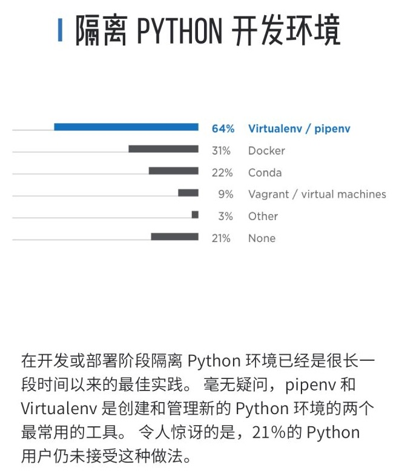

# 虚拟环境

实际的Python环境中，往往会用到多个不同的Python版本，以及每个项目中往往用到不同的库，且版本不同。

如果都安装到一个环境中，就会导致混乱和冲突，无法正常开发。

对此，可以用Python的`虚拟环境`去解决：隔离不同项目中的Python版本和依赖的库。

Python的虚拟环境工具，目前常见的有：

* `Virtualenv`/`Pipenv`
* `Docker`
* `Conda`
* 等

如图：

