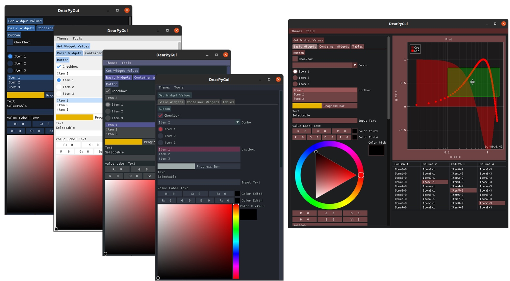

# 有趣的库

此处整理一下有趣的Python的库

## rich

* Github
  * [willmcgugan/rich: Rich is a Python library for rich text and beautiful formatting in the terminal.](https://github.com/willmcgugan/rich)
    * https://github.com/willmcgugan/rich
* 截图
  * 

## DearPyGui

* `DearPyGui`
  * 一款新的Python的GUI图形库
  * Github
    * [hoffstadt/DearPyGui: DearPyGui: A GPU Accelerated Python GUI Framework](https://github.com/hoffstadt/DearPyGui)
      * https://github.com/hoffstadt/DearPyGui
  * 相关
    * [ocornut/imgui: Dear ImGui: Bloat-free Graphical User interface for C++ with minimal dependencies](https://github.com/ocornut/imgui)
  * 截图
    * 
