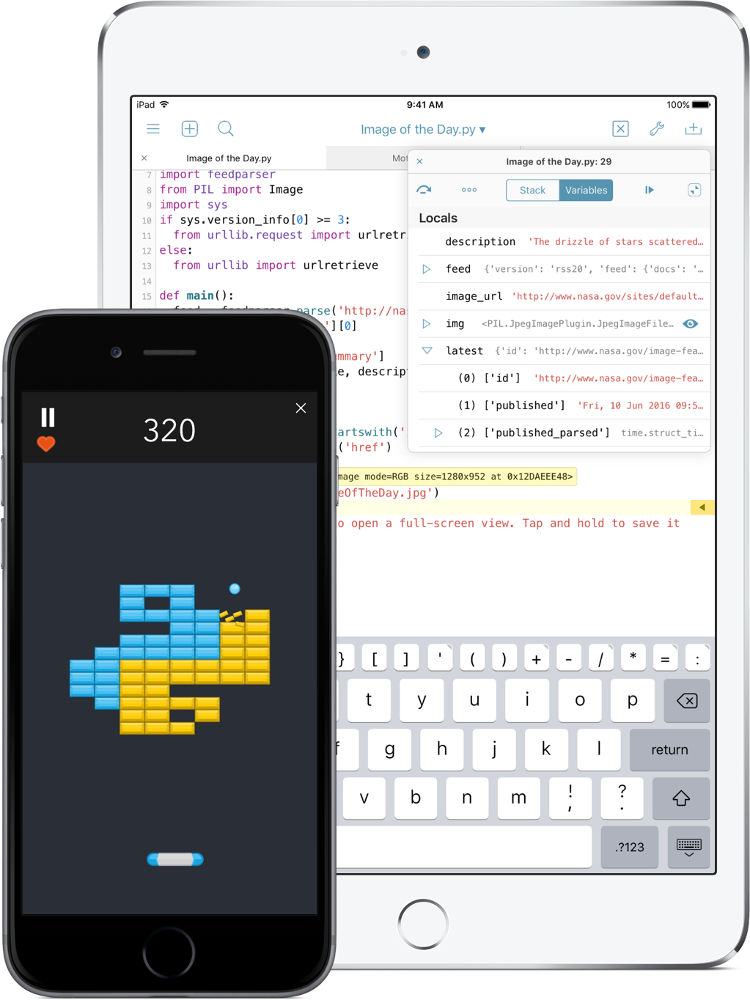

# Python开发iOS/Mac的程序

Q:

[脚本-CSDN论坛](https://bbs.csdn.net/topics/396829742)

> 怎么让苹果手机执行python脚本
> 
> 比如淘宝自动签到
> 
> 能不能把脚本打包成那种软件之类的形式放在屏幕上

A:

你说的应该是：

用Python语言写代码，生成可以在iPhone上运行的程序，即打包生成iPhone中的可执行文件，即用Python开发iOS程序

目前能找到的有：`beeware`

* beeware
  * 官网
    * Write once. Deploy everywhere.— BeeWare
      * https://beeware.org
  * 文档入口
    * How to use BeeWare— BeeWare
      * https://beeware.org/project/using/
    * BeeWare — BeeWare 0.3.0 documentation
      * https://docs.beeware.org/en/latest/
    * 关于针对iOS的打包
      * Tutorial 5 - Taking it mobile: iOS — BeeWare 0.3.0 documentation
        * https://docs.beeware.org/en/latest/tutorial/tutorial-5/iOS.html
  * Github
    * 新：Python-Apple-support
      * beeware/Python-Apple-support: A meta-package for building a version of Python that can be embedded into a macOS, iOS, tvOS or watchOS project.
        * https://github.com/beeware/Python-Apple-support
    * 旧=已废弃：Python-iOS-support
      * pybee/Python-iOS-support: A meta-package for building a version of Python that can be embedded into an iOS project.
        * https://github.com/pybee/Python-iOS-support

另外，其他相关的有：

* 用Python开发可以在桌面端Mac运行的程序（app/pkg/dmg等）
  * 可以用Python写代码
  * 再用PyInstaller打包
    * PyInstaller
      * 
* 在iPhone（或iPad）中写Python代码=做Python开发
  * Pythonista for iOS
    * http://omz-software.com/pythonista/
  * 截图
    * 
