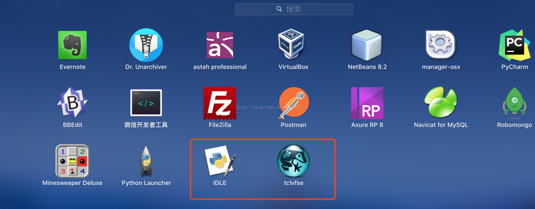
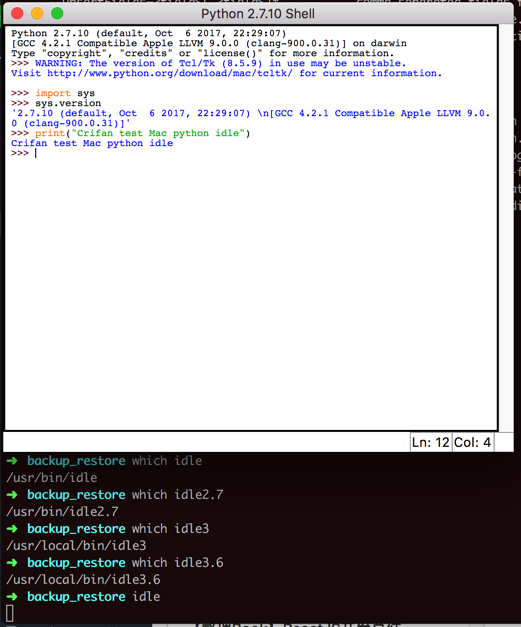
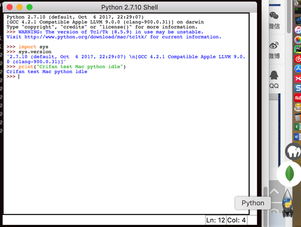
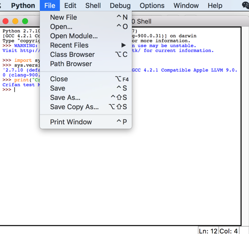
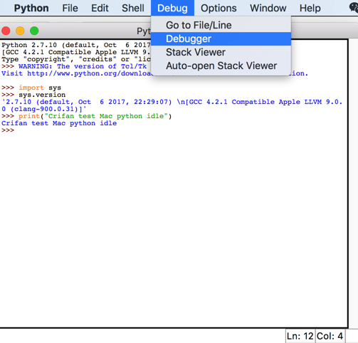
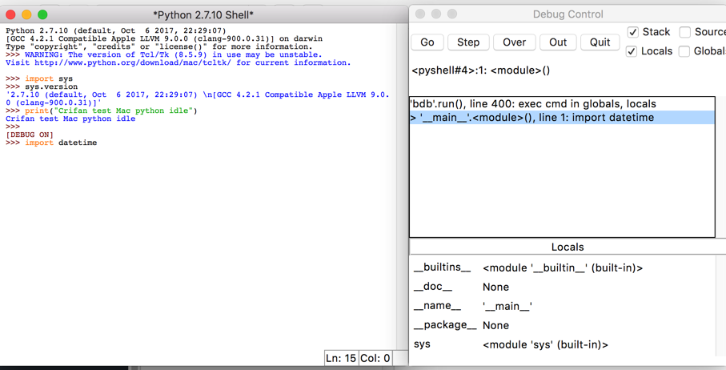

# 自带IDE：IDLE

`Python`安装后，往往自带一个`IDE`，叫做`IDLE`

> #### warning:: IDEL对新手不友好，所以不推荐
> 
> 不过由于其对于新手不够友好，甚至有时候会误导新手。所以不建议作为第一个使用的`Python`的IDE去使用
> 
> 还是推荐新手用`VSCode`或`PyCharm`，详见：[Python的IDE · 让你人生不苦短的编程语言：Python](https://book.crifan.com/books/make_life_better_python/website/py_dev/py_ide/)
> 

虽然不推荐，但是也简单介绍一下，供需要的了解。

## Mac中的`IDLE`

Mac中安装Python后，正常也是有IDLE的。

可以在`启动台`=`Launcher`中看到：



但是我这里却找不到：


不过可以去命令行终端中找到：

此处有多个Python版本，对应多个版本的`idle`

```bash
➜  backup_restore which idle
/usr/bin/idle
➜  backup_restore which idle2.7
/usr/bin/idle2.7
➜  backup_restore which idle3
/usr/local/bin/idle3
➜  backup_restore which idle3.6
/usr/local/bin/idle3.6
```

输入:

```bash
idle
```

以启动Mac中的`IDLE`看看是啥效果：



Docker中可以看到图标是`Python`：



基本上可以理解为：

`python`的`shell`的彩色版本

当然作为IDE，也是有基本的功能的：

* File
  * 
* Debug
  * 
  * 

总体来说，还是很难用的。

另外，`Control+C`去（强制）退出时，还报错了：

```bash
➜  backup_restore idle
*** Internal Error: rpc.py:SocketIO.localcall()
Object: gui_adapter
Method: <bound method GUIAdapter.interaction of <idlelib.RemoteDebugger.GUIAdapter instance at 0x110cc3d88>>
Args: (‘<pyshell#4>:1: <module>()’, 4397130240, None)

Traceback (most recent call last):
  File "/System/Library/Frameworks/Python.framework/Versions/2.7/lib/python2.7/idlelib/rpc.py", line 188, in localcall
    ret = method(*args, **kwargs)
  File "/System/Library/Frameworks/Python.framework/Versions/2.7/lib/python2.7/idlelib/RemoteDebugger.py", line 284, in interaction
    self.gui.interaction(message, frame, modified_info)
  File "/System/Library/Frameworks/Python.framework/Versions/2.7/lib/python2.7/idlelib/Debugger.py", line 197, in interaction
    b.configure(state="disabled")
  File "/System/Library/Frameworks/Python.framework/Versions/2.7/lib/python2.7/lib-tk/Tkinter.py", line 1326, in configure
    return self._configure(‘configure’, cnf, kw)
  File "/System/Library/Frameworks/Python.framework/Versions/2.7/lib/python2.7/lib-tk/Tkinter.py", line 1317, in _configure
    self.tk.call(_flatten((self._w, cmd)) + self._options(cnf))
TclError: invalid command name ".4576786048.4576788064.4576787920"
[1]    52979 terminated  idle
```

忽略之，当然也懒得继续研究了。
