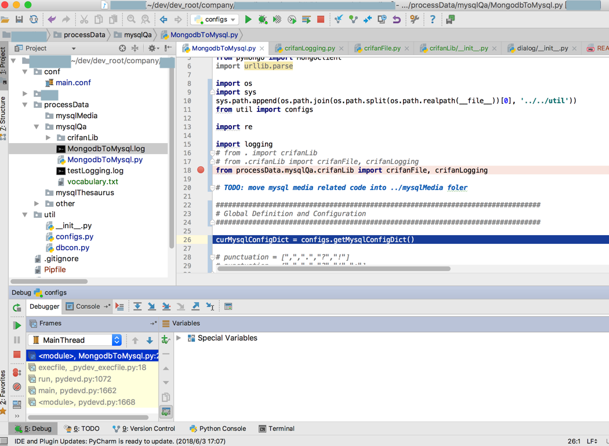

# import导入

## 相对路径导入

此处目录结构是：

```bash
devRoot
    processData
        __init__.py
        mysqlQa
            __init__.py
            crifanLib
                __init__.py
                crifanFile
                crifanLogging
```

> 后记：无意间发现：
> 
> 去掉`processData`下面的`__init__.py`
>
> 去掉`mysqlQa`下面的`__init__.py`
> 
> 也是不影响后续的导入的

写法：

```python
from processData.mysqlQa.crifanLib import crifanFile, crifanLogging
```

即可导入：



## `递归导入`=`循环导入`的问题

此处文件目录结构是：

```bash
(xx-VJ297lRu) [root@xxx-general-01 crifanLib]# tree -CF
.
├── crifanBeautifulsoup.py
├── crifanCookie.py
├── crifanDatetime.py
├── crifanEmail.py
├── crifanFile.py
├── crifanGeography.py
├── crifanHtml.py
├── crifanHttp.py
├── crifanList.py
├── crifanLogging.py
├── crifanMath.py
├── crifanMysql.py
├── crifanOpenpyxl.py
├── crifanString.py
├── crifanSystem.py
├── crifanTemplate.py
├── crifanUrl.py
└── __init__.py

0 directories, 18 files
(xx-VJ297lRu) [root@xx-general-01 crifanLib]# pwd
/root/xx/nlp/xx/util/crifanLib
(xx-VJ297lRu) [root@xx-general-01 crifanLib]# 
```

其中，存在循环=递归导入的问题：

* `crifanFile` 导入了 `crifanList`
* `crifanList` 导入了 `crifanString`
* `crifanString` 导入了 `crifanHttp`
* `crifanHttp` 导入了 `crifanFile`

此处解决递归导入的办法，有几种：

### 方法1：用的时候再导入

**具体操作**：把文件顶部的导入，移动到具体文件内部用到别人库的函数的地方，再导入

**缺点**：麻烦，不利于直观看到引用了哪些库

### 方法2：改为 `from someOtherLib import someFunction`

缺点：如果用到多个函数，要写多个

> #### warning:: 据说Python官网中竟然不推荐`from xxx import yyy`
> 之前好像在哪里看到Python官网中好像说是：
> 
> * 建议用：import X
> * 不是很建议用：
  ```python
  from module import *
  from module import a,b,c
  ```
> 和我之前的理解，有偏差，以为：
> 
> * 为了性能更好，不要一次性全部导入`import xxx`
> * 而应该用：`from xxx import yyy`
> 
> 呢

### 方法3：写成带模块名的`绝对路径`的导入

把：

```python
from . import crifanList
```

改为：

```python
import crifanLib.crifanList
```

即可。此处最后采用此方式。
