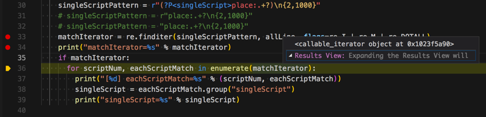

# `iterator`迭代器

**迭代**是Python最强大的功能之一，是访问集合元素的一种方式。

**迭代器**`iterator`是一个可以记住遍历的位置的对象。

## 常见问题

### iterator对象被访问过一次后，就无效了，值就变成空了

比如对于下面的代码

```python
    matchIterator = re.finditer(singleScriptPattern, allLine, flags=re.I | re.M | re.DOTALL)
    print("matchIterator=%s" % matchIterator)
    if matchIterator:
      for scriptNum, eachScriptMatch in enumerate(matchIterator):
        print("[%d] eachScriptMatch=%s" % (scriptNum, eachScriptMatch))
        singleScript = eachScriptMatch.group("singleScript")
        print("singleScript=%s" % singleScript)
```

其中的：

`if matchIterator:`

本意是：

判断`re.finditer`不为空，然后后续用`for`循环获取每个值

结果却变成了：

用`if`去判断`matchIterator`后，就是对`matchIterator`的一次操作，然后`iterator`类型的`matchIterator`的值就变成空了



就无效了。

->后续代码当然也就不起效果了。
