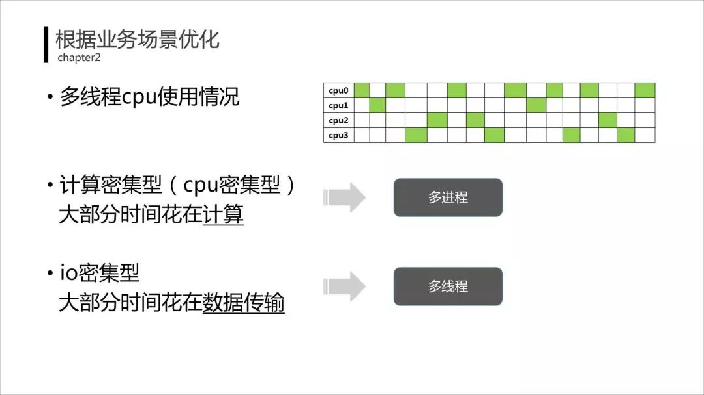
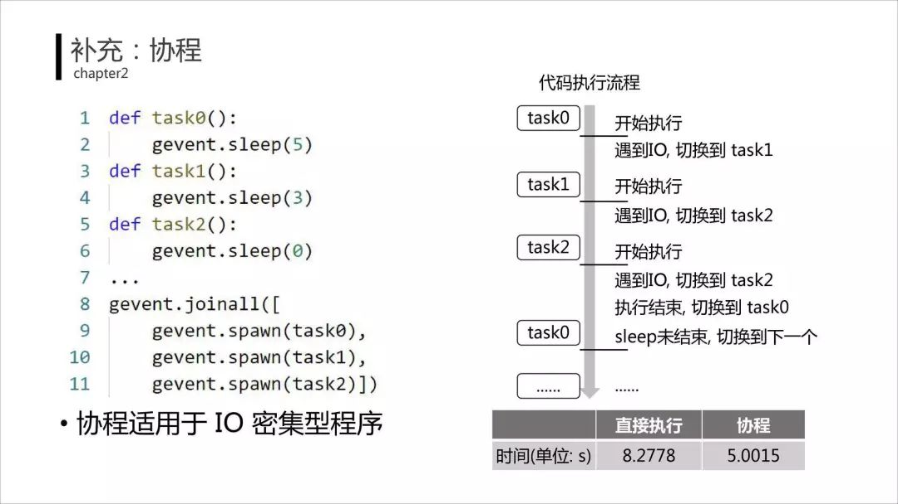

# 多线程

Python也支持多线程。

* 进程和线程
  * （多）进程
    * 系统分配资源的最小单位
    * python库：multiprocessing
      * from multiprocessing import Process
    * 缺点
      * 进程间共享资源不方便
        * 比如变量共享
      * 资源开销比较大
        * 需要先创建，用完再销毁
      * 进程间切换比较耗时
  * （多）线程
    * python库：threading
      * from threading import Thread
    * 特点
      * 进程间共享资源方便 = 简单
      * 开销小
        * 单个进程中可以创建多个线程
  * 对比
    * 
      * CPU密集型
      * I/O密集型
        * 结论：用协程
          * 
          * 协程：
            * 用户态轻量级的线程
            * 有自己的寄存器和上下文切换
            * 比线程还要更轻量

期间涉及到：

* `全局解释器锁`=`GIL`=`Global Interpreter Lock`
