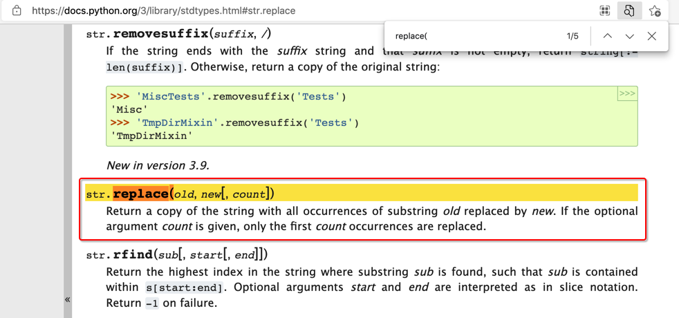
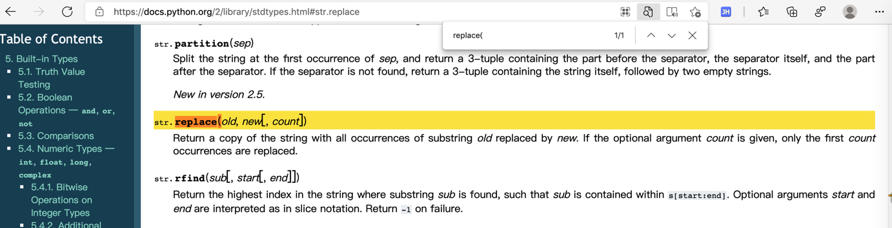
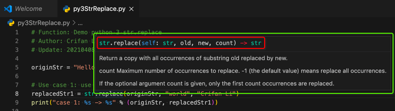
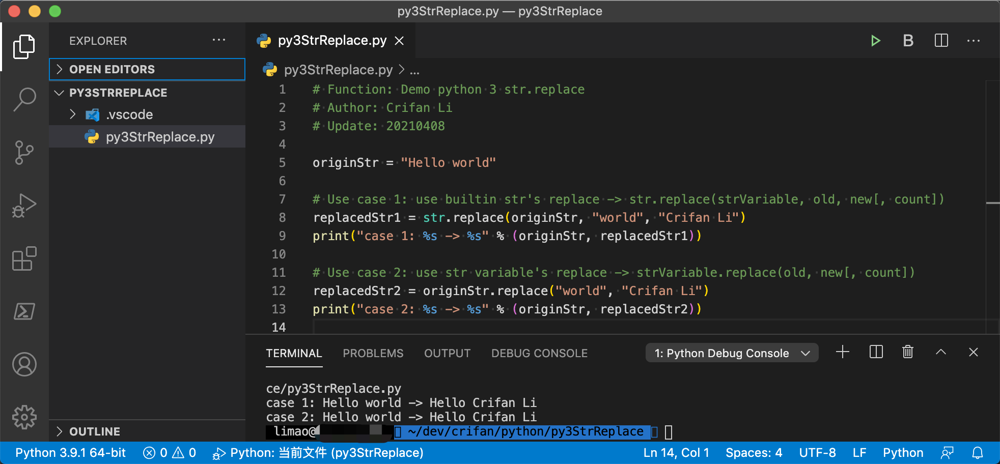

# `str.replace`

`Python`中用来实现字符串替换的是`str.replace`

* 语法
  * 官网文档
    * `Python 3`
      * https://docs.python.org/3/library/stdtypes.html#str.replace
        * 
        > str.replace(old, new[, count])
        > 
        > Return a copy of the string with all occurrences of substring old replaced by new. If the optional argument count is given, only the first count occurrences are replaced
    * 对比：`Python 2`的官网文档，解释也基本类似：
      * https://docs.python.org/2/library/stdtypes.html#str.replace
        * 
        > str.replace(old, new[, count])
        > 
        > Return a copy of the string with all occurrences of substring old replaced by new. If the optional argument count is given, only the first count occurrences are replaced

对应着，VSCode中的语法提示是：



对应着，常见的，具体的用法，有2种：

* 使用方式1：直接用str的replace，即：`str.replace(strVariable, old, new[, count])`
    ```python
    replacedStr1 = str.replace(originStr, "from", "to")
    ```
* 使用方式2：用字符串变量，即：`strVariable.replace(old, new[, count])`
    ```python
    replacedStr2 = originStr.replace("from", "to")
    ```

完整demo代码：

```python
# Function: Demo python 3 str.replace
# Author: Crifan Li
# Update: 20210408

originStr = "Hello world"

# Use case 1: use builtin str's replace -> str.replace(strVariable, old, new[, count])
replacedStr1 = str.replace(originStr, "world", "Crifan Li")
print("case 1: %s -> %s" % (originStr, replacedStr1))

# Use case 2: use str variable's replace -> strVariable.replace(old, new[, count])
replacedStr2 = originStr.replace("world", "Crifan Li")
print("case 2: %s -> %s" % (originStr, replacedStr2))
```

输出：

```bash
case 1: Hello world -> Hello Crifan Li
case 2: Hello world -> Hello Crifan Li
```

效果：



> #### warning:: `str.replace`中的old和new，不支持**正则**的语法
> 
> 所以之前的代码：
> 
> `sortedUrlList.sort(key=str.replace("^https?://", "", ))`
> 
> 虽然能运行，但是逻辑不对。只是把`"^https?://"`当成了普通字符串而已 -》没有实现希望的正则替换的效果