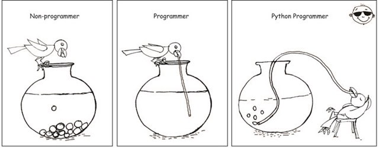
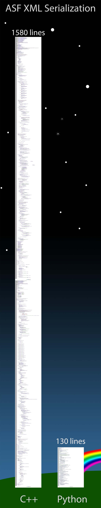

# Python概述

现有编程语言众多，其中有个叫`Python`

不同的人对其有各种不同的评价，其中让人最为印象深刻和精辟的一个评价是：

**人生苦短，我用Python**

意思就是：相对其他语言来说，用Python搞开发，可以让你人生不那么苦短

借用[某图](https://hackernoon.com/10-useful-tools-and-libraries-for-programmer-and-it-professionals-914e64e0eabc)来说明 = 一图胜千言：

形象的表现出：

如果会了Python，你可以在编程(工作)期间

高效的、方便的实现各种工具和系统，从而

-> **让（打工）人生不（那么）苦短**

-> **用更少的代码，更好的实现更多的功能**

## 举例：实现同样功能的`C++`和`Python`的代码量的对比

此处通过，实现同样的功能，`ASF XML Serialization`，所需要的`C++`代码和`Python`代码做个对比：

就更能直观的体会到，什么叫做：

**人生苦短，我用Python**

即：用别的语言搞技术开发，有多么**苦逼**了。
