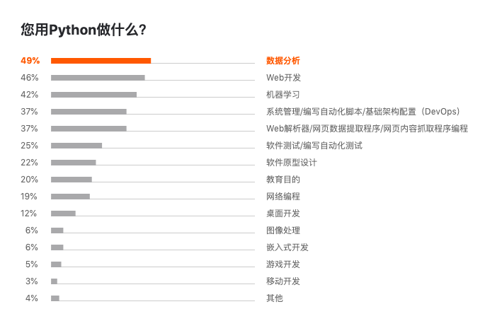
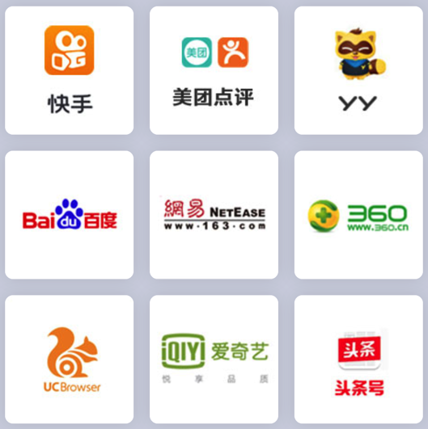
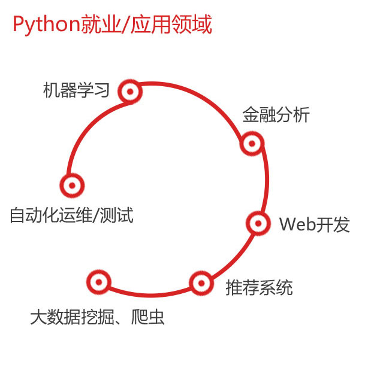
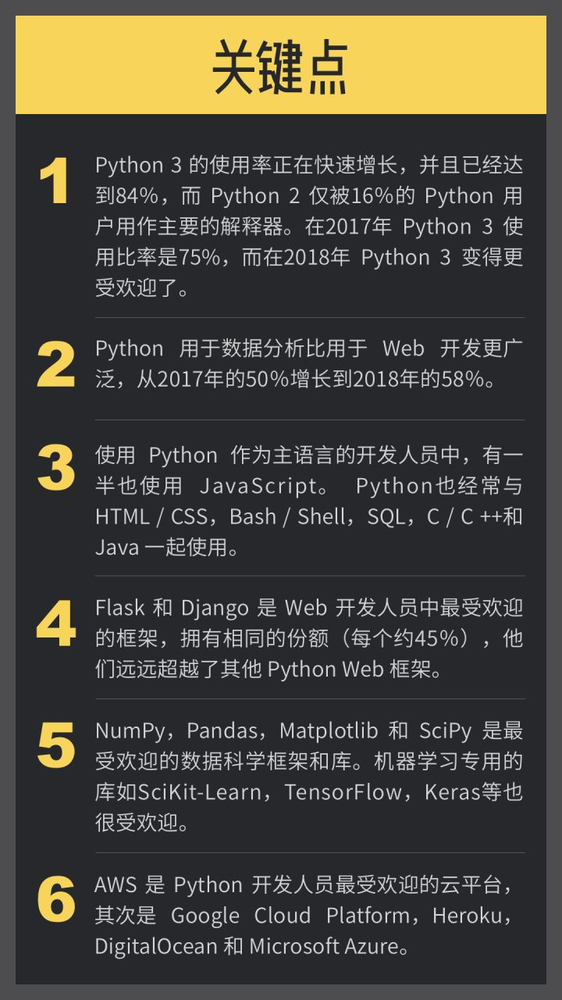
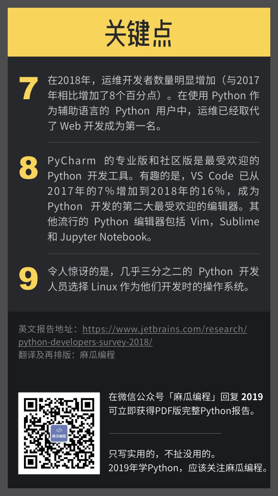

# Python典型用途

Python语言可以有很多用途。

此处贴出一些统计数据，供了解大概情况：

* 

## Python相关工作、职业、公司
* 在用Python的企业
  * 
* Python就业=应用领域
  * 
  * 
* 典型Python职位 = 工作方向
  * Python 全栈工程师
  * Python Web开发工程师
  * Python 爬虫工程师
  * Python 数据分析师
  * Python 数据挖掘师
  * Python 机器学习工程师
  * Python 数据处理工程师
  * Python 推荐系统工程师
  * Python 推荐系统架构师
* 计算机领域=业界 的一些Python应用
  * 电信基础设施 ([Twilio](https://en.wikipedia.org/wiki/Twilio))
  * 支付系统 ([PayPal](https://en.wikipedia.org/wiki/PayPal), [Balanced Payments](https://www.balancedpayments.com/))
  * 神经科学和心理学 ([许多](http://journal.frontiersin.org/ResearchTopic/8), [许多](http://journal.frontiersin.org/ResearchTopic/1622), [例子](http://neuralensemble.org/))
  * 数值分析和工程 ([numpy](https://en.wikipedia.org/wiki/NumPy), [numba](https://numba.pydata.org/), 以及 [更多其它](https://numba.pydata.org/))
  * 动画([LucasArts](https://en.wikipedia.org/wiki/LucasArts), [Disney](http://www.disneyanimation.com/technology/opensource), [Dreamworks](https://en.wikipedia.org/wiki/DreamWorks_Animation))
  * 游戏后台 ([Eve Online](https://en.wikipedia.org/wiki/Eve_Online), [Second Life](https://en.wikipedia.org/wiki/Second_Life), [Battlefield](https://en.wikipedia.org/wiki/Battlefield_%28series%29), 以及 [其它很多](https://wiki.python.org/moin/PythonGames))
  * Email基础设施 ([Mailman](https://en.wikipedia.org/wiki/GNU_Mailman), [Mailgun](http://www.rackspace.com/mailgun))
  * 媒体存储和处理 ([YouTube](https://en.wikipedia.org/wiki/YouTube), [Instagram](http://instagram-engineering.tumblr.com/post/13649370142/what-powers-instagram-hundreds-of-instances), [Dropbox](https://tech.dropbox.com/))
  * 操作和系统管理 ([Rackspace](https://en.wikipedia.org/wiki/Rackspace), [OpenStack](https://www.openstack.org/))
  * 自然语言处理([NLTK](http://www.nltk.org/))
  * 机器学习和计算机版本 ([scikit-learn](http://scikit-learn.org/stable/), [Orange](http://orange.biolab.si/), [SimpleCV](http://simplecv.org/))
  * 安全性和渗透性测试 ([很多很多](https://github.com/dloss/python-pentest-tools) 以及 [eBay/PayPal](https://www.paypal-engineering.com/2014/12/10/10-myths-of-enterprise-python/#ebay-paypal-python-security) )
  * 大数据 ([Disco](http://discoproject.org/), [Hadoop support](http://blog.cloudera.com/blog/2013/01/a-guide-to-python-frameworks-for-hadoop/))
  * 如理 ([Calendar Server](http://calendarserver.org/), 它 [驱动了 Apple iCal](https://en.wikipedia.org/wiki/Calendar_and_Contacts_Server))
  * 搜索系统 ([ITA](http://www.eweek.com/c/a/Application-Development/Python-Slithers-into-Systems/), [Ultraseek](https://www.python.org/about/success/verity/), 还有 [Google](https://news.ycombinator.com/item?id=8587697))
  * Internet 基础设施 (DNS) ([BIND 10](http://www.isc.org/blogs/programming-languages-for-bind-10/))

更多Python的应用，可参考官网的列表：[Python Success Stories | Python.org](https://www.python.org/about/success/)

## Python的使用

参考一些报告，有些结论供参考：

* Jetbrains的2018年的Python报告
  * 用Python语言的人
    * **84%**是用作主要语言的
    * 除了Python，还用
      * `JavaScript`，`HTML`/`CSS`，`Bash`/`Shell`，`SQL`等
    * **60%**用作工作（和个人）方面
    * 用来做什么
      * `数据分析`
      * `Web开发`
      * `运维/系统管理/自动脚本`
      * `机器学习`
      * `网页解析和爬虫`
      * `软件测试/自动化测试`
      * `教学目的`
      * `软件原型`
    * Python版本：
      * **84%**都用`Python3`了
        * `Web开发`，`数据分析`，`运维`中用Python3最多
      * **16%**还用Python2
  * 关键点
    * 
    * 
